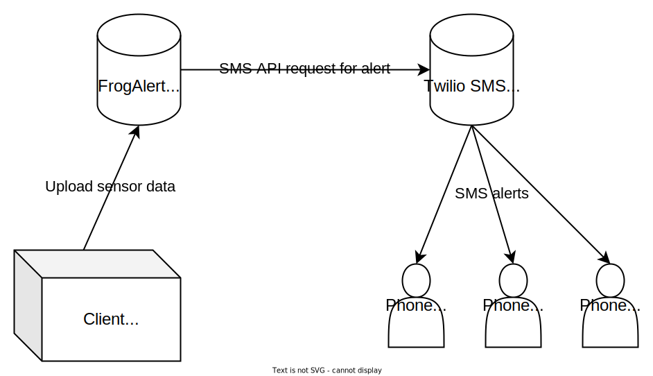

# Frog Alert

Frog Alert is a web application which is one part in an monitoring system for contained environments.

## Purpose

The purpose this was written for was to monitor the delicate environment of some exotic frogs in a vivarium. In case the environment enters dangerous conditions for the frogs within, an SMS alert is sent to the configured phone numbers.

## How it works?

A client submits environment snapshots to the FrogAlert API. The FrogAlert's monitoring service will loop checking the most recent environment snapshot, checking one of the following conditions:

- If the temperature/humidity of the most recent environment snapshot is out of safe bounds.
- If the most recent environment snapshot is too old. This indicates the client could be down.

If one of the above conditions is met, the monitoring service will send a request to the Twilio SMS API to send an SMS alert to all the configured phone numbers. Different alert messages are sent based on the condition that were met.

If one of the above conditions were previously met, but no longer apply, an all clear message is sent out.

### Default Alert Messages

Temperature/humidity out of range:

```
Frog Alert! Environment temperature is out of bounds.

Temperature: 24.2 C
Humidity: 78.1
Time Taken: Feb 22 2023 16:37:16 UTC
```

No recent data:

```
Frog Alert! No recent data submitted to server.

Last environment snapshot data listed below.
Temperature: 23.4 C
Humidity: 78.1
Time Taken: Feb 22 2023 16:34:31 UTC
```

All clear:

```
The previous alert is no longer active.
Latest environment snapshot:

Temperature: 23.2 C
Humidity: 78.1%
Time Taken: Feb 22 2023 16:37:56 UTC
```

## Architecture

There are four components of the architecture for the FrogAlert system:

- FrogAlert API - The code contained within this repository. The web server responsible for receiving sensor readings and generating alerts based on sensor data.
- Client (Vivarium Sensors) - A client responsible for submitting sensor data to the FrogAlertAPI.
- Twilio SMS API - An API provided by [Twilio](https://www.twilio.com/) for sending SMS messages.
- Phones - Phones responsible for receiving alerts, to alert possible managers of the vivarium.



## API Consumption

The Frog Alert web application receives environment snapshots through POST requests on the `/environment` endpoint. This data includes 2-3 parameters:

1. Humidity (mandatory) - the humidity of the environment.

   URL parameter: `humidity`

   Example: `70.4%` submitted as `70.4`

2. Temperature (mandatory) - the temperature of the environment.

   URL parameter: `tempC`

   Example: `22.3°C` submitted as `22.3`

3. Time (optional) - the time the environment snapshot was taken. If not provided, the current time on the server when the request is being processed will be used.

   URL parameter: `time`

   Example: `2022-02-19T16:04:14.291Z`

An example on how to submit code to the API is provided within the `FrogAlert.FakeClient` C# project.
